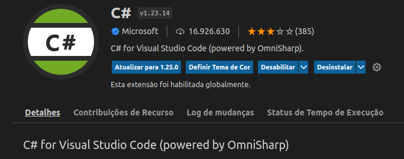
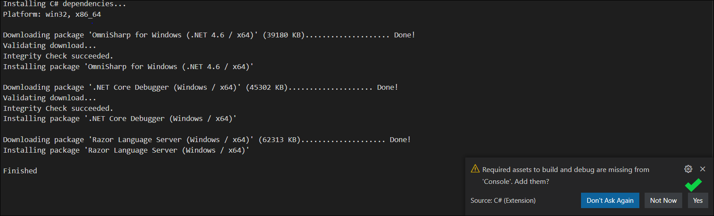
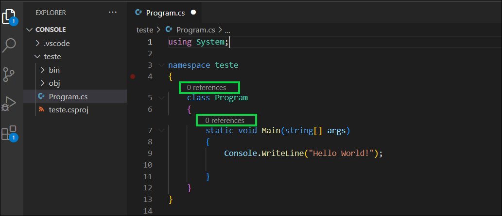
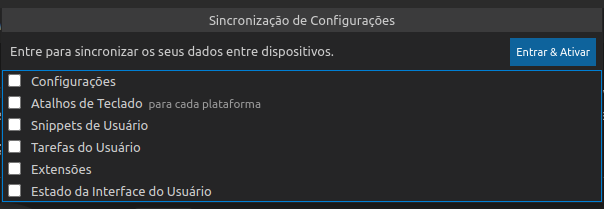

# Solução : Omnisharp não inicia (Visual Studio Code) - Resolvido de maneira sagaz

Olá pessoal, venho a compartilhar com vocês um método de resolução para usuários do Visual Studio Code(V1.69.2 ou + recente) que estão com problemas principalmente com o IntelliCode da extensão C# oficial provisionada pelo servidor do Ominisharp.

Obs: Feche o VSCODE e se preciso pare seus processos e saia se estiver logado em alguma conta pelo VSCODE (Github ou Microsoft)

esta é uma resolução para aqueles que :

    1° : A galera que está usando o Runtime/sdk do C# Dotnet na Versão : 5.0.408
    2° : Não há suporte IntelliCode da extensão c# no VSCODE que gera códigos/usings/funções/dicas etc.. 
    3° : Para aqueles que em algum momento alterou o arquivo Json do Settings e quebrou o IntelliCode do C# sem saber
    4° : Para aqueles que mesmo adicionando os Breadcumbs/Edit no Json e mesmo assim não solucionou o problema 
    5° : Para quem tomou erro no Ominisharp de "server not running" ou "timeout". 

- **Passo 1 remover** o Arquivo *Settings* do VSCODE :

    **Usuários Windows** : 

        1º : Pressione 'Windows-Key"+R , e cole e dê ok em %APPDATA%\Code\User - neste caminho apague o settings.json
        2º : Pressione 'Windows-Key"+R , e cole e dê ok em %USERPROFILE%\.vscode\extensions - neste caminho apague todas as pastas e arquivos

    **Usuários Linux(20.04 ou + recente)** : 

        1° : No terminal execute : cd ~ && rm -rf .vscode && rm -rf .config/Code

- **Passo 2**:

    Feito os procedimentos crie um projeto(pode ser um aplicativo de console) e o abra no VSCODE;
    Acesse o arquivo Program.cs, provavelmente aparecerá um Pop-up perguntando se você gostaria de adicionar a
    extensão clique em sim caso não apareça pesquise na aba de extenções por **C#** , a extenção deverá ser Essa :  

    **Ponto de atenção ->**
        Instale a versão : **1.23.14** e recarregue o VSCODE 
    #
    
    #

- **Passo 3**:
    Verifique a guia de *Output* e note que os pacotes do Ominisharp estarão sendo instalados e será solicitada uma permissão de Assets para você
    Clique em **Sim** conforme abaixo :

    #
    
    #

- **Passo 4**:
    Verifique seu Arquivo *Program.cs* e veja se já há pontos de referência, isso indica que o Ominisharp está funcionando adequadamente
    
    #
        
    #

- **Dica**:
    Caso precise Sincronizar com uma conta GitHub ou Microsoft desmarque as configurações de entrada, isso garante que
    não será puxado nenhuma configuração que quebre o IntelliCode do Ominisharp, veja : 

    #
        
    
    **Pronto Problema Resolvido, espero ter lhe ajudado!!**
    #

                     

